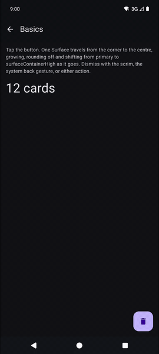

# MorphingFab

A floating action button that morphs into an alert dialog, for Compose Multiplatform.



Both states are the same `Surface`. One progress value drives its position, size, corner radius and
colour, so the button becomes the dialog rather than one thing vanishing and another appearing.

## Usage

```kotlin
var open by remember { mutableStateOf(false) }

MorphingFab(
    expanded = open,
    onFabClick = { open = true },
    onDismissRequest = { open = false },
    title = "Delete 12 cards?",
    text = "They'll be removed from this binder.",
    confirmLabel = "Delete",
    onConfirm = { open = false; delete() },
    dismissLabel = "Cancel",
    fabContent = { Icon(Icons.Default.Delete, contentDescription = "Delete") },
)
```

Render it at the root of your screen, as a sibling of your content. It fills its parent and works
out where the FAB rests itself.

For a body that isn't icon, title, text and two buttons, the other overload swaps those five
parameters for `dialogContent: @Composable ColumnScope.() -> Unit`.

### Parameters

| Parameter | Default | |
|---|---|---|
| `placement` | `BottomEnd()` | Where the collapsed FAB rests. |
| `style` | `MorphingFabStyle()` | Geometry, and the two crossfade thresholds. |
| `colors` | `MorphingFabDefaults.colors()` | `primary` for the FAB, `surfaceContainerHigh` for the dialog. |
| `animationSpec` | `tween(350, FastOutSlowInEasing)` | Pass `snap()` to honour reduced motion. |
| `fabTransform` | `None` | A second transform on the collapsed FAB. |

`fabContent` has no default. There's no icon dependency and no opinion about what belongs in a FAB.

The thresholds worth knowing about are `fabContentFadeOutBy` (`1/3`) and `dialogContentFadeInFrom`
(`0.55`). The icon is gone by the first third and the dialog's content doesn't start until the
surface is over half grown, so text is never drawn inside a FAB-sized box. Set the second to `0` to
see what it prevents.

## Placement

`BottomEnd` rests the FAB in the corner, inset by `edgePadding` and clear of the navigation bar.
Pass `bottomInset` if you have a floating bottom bar. That and the navigation bar inset are combined
by taking the larger of the two rather than by adding them, since such a bar usually applies its own
`navigationBarsPadding()`.

Don't put a `BottomEnd` one in `Scaffold`'s `floatingActionButton` slot. It calls `fillMaxSize()`,
and `Scaffold` lifts that slot by its own measured height, so a full-height overlay gets lifted by
the height of the screen and the FAB lands near the vertical middle. Use `Anchored` there:

```kotlin
var bounds by remember { mutableStateOf<Rect?>(null) }

Scaffold(floatingActionButton = { MorphingFabAnchor(onBoundsChanged = { bounds = it }) }) { … }

MorphingFab(placement = MorphingFabPlacement.Anchored(bounds), …)
```

Bounds must be in window coordinates, which is what `MorphingFabAnchor` reports. Nothing draws while
they're `null`.

## Launch morph

`fabTransform` applies to the collapsed FAB only, so a FAB can double as a shared element: on taps
that navigate instead of opening the dialog, it shrinks into a circle that the destination's
circular reveal grows out of.

```kotlin
fabTransform = MorphingFabTransform(
    scale = 1f - 0.7f * launch.value,
    cornerCircularity = launch.value,
    contentAlpha = 1f - launch.value * 2f,
)
```

Three plain floats, driven by an `Animatable` of your own, because the library can't know when you
navigate.

## How it works

The expanded state renders in a window-level `Popup` rather than in the composable tree. Drawn in
the tree, "full size" only means the slice of the tree the component sits in, so a `fillMaxSize()`
scrim comes out as a rectangle in the middle of the screen. The collapsed FAB does stay in the tree,
because a full-screen popup swallows every touch and would leave the rest of the screen dead while
the FAB just sits there.

That means the two branches draw in different coordinate spaces, and the seam is invisible only if
both land on the same pixel. The popup gets the FAB rect in window coordinates; the tree gets it
translated by `positionInWindow()`. A constant error between them is hidden on the way out and
obvious on the way back, as a snap at the end of the morph. If you see that, measure the seam before
touching the easing.

The dialog's content is laid out at its final size with `requiredSize` while the surface is still
growing, so text wraps once and fades in instead of re-wrapping every frame.

## Installing

Copy the `morphingfab/` directory into your project, add it to `settings.gradle.kts`, then:

```kotlin
commonMain.dependencies { implementation(project(":morphingfab")) }
```

## Sample

```
./gradlew :androidApp:installDebug
```

Five demos, written once in `commonMain`. The home screen has a "Reduce motion" switch that swaps
the spec for `snap()` everywhere.

For iOS, open `iosApp/iosApp.xcodeproj` and run the `iosApp` scheme. Pick an actual Apple-silicon
simulator rather than "Any iOS Simulator Device", which fails with `Unknown iOS simulator arch:
'x86_64'`.

## Licence

Apache 2.0.
